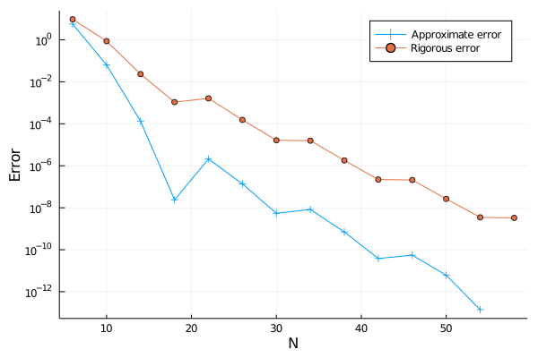

# MethodOfParticularSolutions.jl

This is a package for computing eigenvalues and eigenfunctions of the
Laplacian on planar or spherical domains using the method of
particular solutions in Julia.

## Installation
The package is not in the general Julia repositories and does in
addition depend on
[ArbTools.jl](https://github.com/Joel-Dahne/ArbTools.jl) which is not
in the repositories either. You can install both of them through the
package manager.
``` julia
pkg> add https://github.com/Joel-Dahne/ArbTools.jl
pkg> add https://github.com/Joel-Dahne/MethodOfParticularSolutions.jl
```

To see if it works correctly you can run the tests with
``` julia
pkg> test MethodOfParticularSolutions
```

## Example
We here show an example of using the package for computing the
fundamental eigenvalue and eigenfunction for the classical example of
the L-shaped domain. The presentation is very similar to that of
Betcke and Trefethen in "Reviving the method of particular solutions".

As a first step we load the required packages and set the precision to
use in the computations, in this case 53 bits.

``` julia
using MethodOfParticularSolutions, Nemo, ArbTools, Plots, LaTeXStrings
RR = ArbField(53)
setprecision(BigFloat, 53)
```

We then define the domain that we want to compute the eigenvalues of,
in this case we use the predefined domain for the L-shaped domain.

``` julia
domain = LShape(RR)
```

Next step is to define the particular solution to use. We use a
predefined one which is the same as that used by Betcke and Trefethen.

``` julia
u = LShapeEigenfunction(domain)
```

We can know produce a plot of `sigma(lambda)` similar to Figure 5.2 in
Betcke and Trefethen.

``` julia
N = 15
λs = range(1, stop = 20, length = 200)
σs = [sigma(λ, domain, u, N) for λ in λs]

plot(λs, σs,
     xlims = (0, 20),
     ylims = (0, 1),
     xlabel = L"\lambda",
     ylabel = L"\sigma(\lambda)",
     legend = :none)
```


We can compute an approximation of the first eigenvalue and
eigenfunction. First we need an interval containing the eigenvalue we
are looking for, since the eigenvalue is approximately given by
9.6397238440219 the interval [9, 10] will do

``` julia
N = 15
interval = setinterval(RR(9), RR(10))
(λ, _) = mps(domain, u, interval, N)
```

This produces the, rather poor, enclosure `[9.6 +/- 0.0679]` and also
sets the coefficients of `u` to that of the approximate eigenfunction.
Using a larger value of `N` we can get a better approximation.

``` julia
N = 32
interval = setinterval(RR(9), RR(10))
(λ, _) = mps(domain, u, interval, N)
```

This gives us the enclosure `[9.6397 +/- 3.99e-5]` which is slightly
better.

Often times you want to iteratively use higher and higher values of
`N` to get better and better approximations. To achieve this we have
the method `iteratemps`. We can use this to create a figure similar to
Figure 5.3 in Betcke and Trefethen to better see the convergence, we
can plot both the approximate error (computed in the same way as they
do) and the rigorous error given by the radius of the enclosing ball.

``` julia
Ns = 6:4:60
λs = iteratemps(domain, u, interval, Ns,
                optim_prec_final = prec(RR),
                show_trace = true)

p = plot(Ns[1:end-1], Float64.(abs.(λs[1:end-1] .- λs[end])),
         xaxis = ("N", 0:10:Ns[end]+9),
         yaxis = ("Error", :log10),
         marker = :cross,
         label = "Approximate error")
plot!(p, Ns, Float64.(radius.(λs)),
      marker = :circle,
      label = "Rigorous error")
```


## References

Fox, L., P. Henrici, and C. Moler. "Approximations and bounds for
eigenvalues of elliptic operators." SIAM Journal on Numerical Analysis
4.1 (1967): 89-102.

Betcke, Timo, and Lloyd N. Trefethen. "Reviving the method of
particular solutions." SIAM review 47.3 (2005): 469-491.
